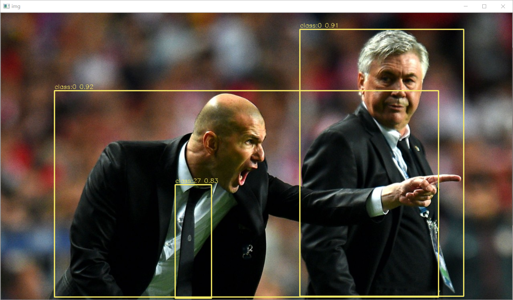

## Introduction

**YOLOv6**是美团发布的**Anchor-free**目标检测模型，本仓库实现**YOLOv6端到端的Tensorrt部署**。

<div align="center">

</div>


## Environment

- Tensorrt 8.4.1.5
- Cuda 10.2 Cudnn 8.4.1
- onnx 1.8.0
- onnx-simplifier 0.3.10
- onnx-graphsurgeon 0.3.19
- Torch 1.10.0

## Benchmark

|    Model    | Size | mAP<sup>val</sup> 0.5:0.95 | GTX1650 FP16(ms) | GTX1650 FP32(ms) | ONNX (EfficientNMS) |
| :---------: | :--: | :------------------------: | :--------------: | :--------------: | :-----------------: |
|   YOLOv6n   | 640  |            35.0            |       6.6        |       8.7        |        model        |
| YOLOv6-tiny | 640  |            41.3            |       10.6       |       16.7       |        model        |
|   YOLOv6s   | 640  |            43.1            |       11.6       |       18.4       |        model        |

说明：此处FP16,fp32预测时间包含**preprocess+inference+nms**，测速方法为warmup10次，预测100次取平均值，并未使用trtexec测速，与官方测速不同；mAP<sup>val</sup>为原始模型精度，转换后精度未测试。

## Quick Start

下载YOLOv6仓库，并导出含有**EfficientNMS**的端到端**ONNX**模型。

```
git clone https://github.com/meituan/YOLOv6
cd YOLOv6
pip install -r requirements.txt
```

导出**FP32** ONNX模型
```
python ./deploy/ONNX/export_onnx.py --weights yolov6s.pt --img 640 --batch 1 --end2end
```

导出**FP16** ONNX模型

```
python ./deploy/ONNX/export_onnx.py --weights yolov6s.pt --img 640 --batch 1 --end2end --half
```

使用Tensorrt官方工具转换engine模型，**FP32预测删除`--fp16`参数即可**。**CUDA10.2+Tensorrt8.4.1存在BUG**，需要指定`--tacticSources=-cublasLt,+cublas`，否则预测时报错，**CUDA11+请忽略该参数**。

```
trtexec --onnx=./yolov6s_half.onnx --saveEngine=./yolov6s_half.engine --fp16 --workspace=30 --tacticSources=-cublasLt,+cublas
```

等待生成序列化模型后，修改本仓库**infer.py模型路径和图片路径**。

```
trt_engine = TRT_engine("./trt_model/yolov6s_half.engine")
img1 = cv2.imread("./pictures/zidane.jpg")
```

```
python infer.py
```

<div align="center">

</div>


## Reference

https://github.com/meituan/YOLOv6

https://github.com/ultralytics/yolov5

https://github.com/Linaom1214/tensorrt-python

https://github.com/triple-Mu
